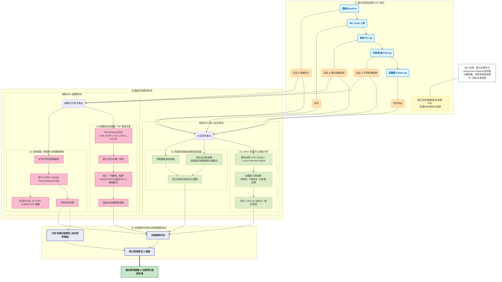

```mermaid
graph TB
    %% 定義樣式
    classDef timeline fill:#e1f5fe,stroke:#0288d1,stroke-width:2px,color:#01579b,font-weight:bold;
    classDef clinical fill:#fff9c4,stroke:#fbc02d,stroke-width:1px;
    classDef sampling fill:#ffe0b2,stroke:#f57c00,stroke-width:2px,stroke-dasharray: 5 5;
    classDef lab_liquid fill:#dcedc8,stroke:#7cb342,stroke-width:1px;
    classDef lab_tissue fill:#f8bbd0,stroke:#c2185b,stroke-width:1px;
    classDef integration fill:#e8eaf6,stroke:#3f51b5,stroke-width:2px,font-weight:bold;
    classDef outcome fill:#c8e6c9,stroke:#388e3c,stroke-width:2px,font-weight:bold;

    %% 標題與核心目標
    Goal["核心目標：建立反應導向(Response-Adapted)監測與分層架構，克服影像與病理不一致的決策盲點"]
    style Goal fill:#fff,stroke:#333,stroke-width:1px

    %% --- 第1部分：臨床流程與採樣 SOP (縱向軸) ---
    subgraph 臨床時序與樣本採集 ["(1) 臨床流程與採樣 SOP 建立"]
        direction LR
        T1("基線 Baseline"):::timeline --> T2("NIC Cycle 1 後"):::timeline --> T3("術前 Pre-op"):::timeline --> T4("手術/術後 Post-op"):::timeline --> T5("追蹤期 Follow-up"):::timeline

        SOP_Docs["建立採血/組織/運送/病理 SOP <br/> 倫理/IRB/匿名化管理"]:::clinical

        %% 採樣點
        S1("採血 & 組織切片"):::sampling
        S2(採血):::sampling
        S3("採血 & 潛在組織採檢"):::sampling
        S4("採血 & 手術組織檢體"):::sampling
        S5(系列採血):::sampling

        T1 --- S1
        T2 --- S2
        T3 --- S3
        T4 --- S4
        T5 --- S5
    end

    %% --- 第2-5部分：實驗室分析 (平行處理) ---
    subgraph 實驗室多模態分析 [ 多模態生物標記檢測 ]
        direction TB

        %% 液態切片分析分支
        subgraph Liquid_Biopsy ["液態切片分析 (血液樣本)"]
            direction TB
            B_Sample(血液樣本集合)

            %% (2) ctDNA 動力學
            subgraph ctDNA_Workflow ["(2) ctDNA 檢測平台與動力學"]
                ctDNA_Dual["雙軌流程: HPV-ctDNA + Tumor-informed ctDNA"]:::lab_liquid
                ctDNA_Kinetics["定義動力學指標:<br/>清除率, 下降斜率, 半衰期, 反彈"]:::lab_liquid
                QC_LoD["建立 LoD/LoQ 與批次一致性監控"]:::lab_liquid
                ctDNA_Dual --> ctDNA_Kinetics --> QC_LoD
            end

            %% (4) 周邊免疫譜
            subgraph Immune_Profiling ["(4) 周邊免疫譜與細胞激素面板"]
                FlowCyto["多色流式細胞儀:<br/>追蹤免疫細胞族群比例變化"]:::lab_liquid
                Cytokine[搭配細胞激素面板]:::lab_liquid
                ImmuneScore[建立系統性免疫活化讀數]:::lab_liquid
                FlowCyto & Cytokine --> ImmuneScore
            end

            B_Sample --> ctDNA_Dual
            B_Sample --> FlowCyto & Cytokine
        end

        %% 組織分析分支
        subgraph Tissue_Analysis ["組織分析 (組織樣本)"]
            direction TB
            T_Sample("組織/切片樣本集合")

            %% (3) TME 重塑定量
            subgraph TME_Profiling ["(3) 組織免疫指標與 TME 重塑定量"]
                IHC_Multi["IHC/Multiplex染色:<br/>CD8, FOXP3, PD-L1/PD-1, IDO 等"]:::lab_tissue
                Scoring["建立評分/定量一致性"]:::lab_tissue
                HotCold["建立「冷轉熱」指標:<br/>CD8/FOXP3 比值與 PD-L1 動態變化"]:::lab_tissue
                Path_Corr["與臨床/病理結局連結"]:::lab_tissue
                IHC_Multi --> Scoring --> HotCold --> Path_Corr
            end

            %% (5) 探索模組
            subgraph Exploratory ["(5) 探索模組: 單細胞/空間層級解析"]
                SelectCases[針對代表性極端個案]:::lab_tissue
                scRNA_ST["進行 scRNA / Spatial Transcriptomics 分析"]:::lab_tissue
                FeatureExtract[萃取抗性特徵]:::lab_tissue
                Backup["若樣本不足: 以 FFPE multiplex IHC 備援"]:::lab_tissue

                SelectCases --> scRNA_ST --> FeatureExtract
                scRNA_ST -.-> Backup
            end

            T_Sample --> IHC_Multi
            T_Sample --> SelectCases
        end
    end

    %% --- 第6部分：整合與建模 (匯聚點) ---
    subgraph Integration_Modeling ["(6) 多模態資料整合與預測模型建立"]
        DataPool[多模態資料池]:::integration
        Modeling["建立預測模型 & 驗證"]:::integration
        %% 【本次主要修正點】加上雙引號
        Feedback["抗性特徵回填模型 (來自探索模組)"]:::integration

        DataPool --> Modeling
        FeatureExtract -.-> Feedback --> Modeling
    end

    %% --- 最終產出 ---
    FinalOutcome["臨床轉譯建議 & 反應導向監測架構"]:::outcome

    %% 流程連接 (將各部分串連)
    Goal --- SOP_Docs
    S1 & S2 & S3 & S4 & S5 --> B_Sample
    S1 & S3 & S4 --> T_Sample

    QC_LoD --> DataPool
    ImmuneScore --> DataPool
    Path_Corr --> DataPool
    FeatureExtract --> DataPool

    Modeling ==> FinalOutcome
```
