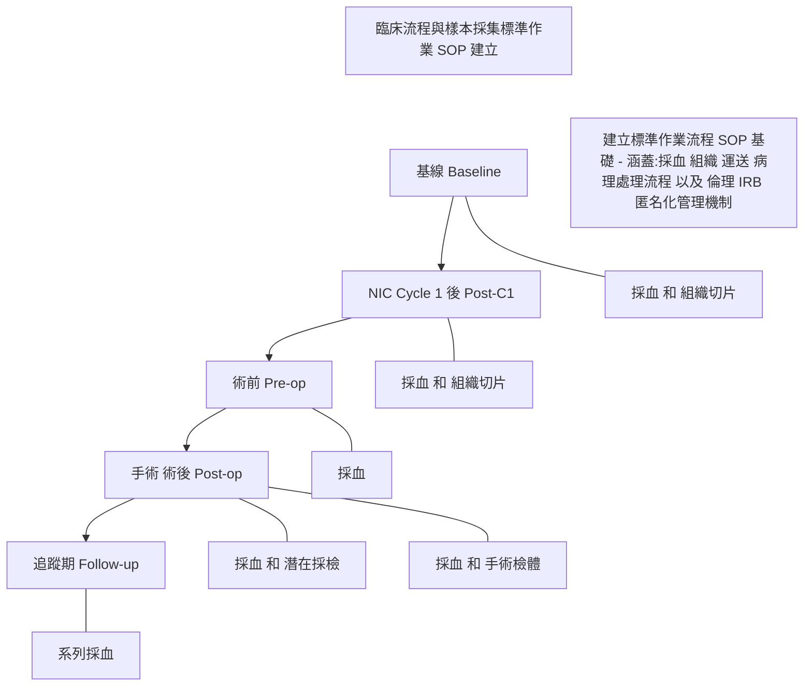

```mermaid
graph TB
    %% =====================================================================================
    %% --- 絕對除錯版 (移除所有樣式與特殊符號) ---
    %% =====================================================================================
    %% 為了確保在 GitHub 上顯示，移除了所有 classDef, linkStyle 和 <br/> 換行

    %% --- 主標題 (改為普通節點) ---
    Title[臨床流程與樣本採集標準作業 SOP 建立]

    %% --- 藍色時間軸節點 (右側) ---
    T1[基線 Baseline]
    T2[NIC Cycle 1 後 Post-C1]
    T3[術前 Pre-op]
    T4[手術 術後 Post-op]
    T5[追蹤期 Follow-up]

    %% --- 紅色採樣動作節點 (左側) ---
    S1[採血 和 組織切片]
    S2[採血 和 組織切片]
    S3[採血]
    S4[採血 和 潛在採檢]
    S5[採血 和 手術檢體]
    S6[系列採血]

    %% --- 綠色 SOP 基礎節點 (最左側) ---
    %% 內容改為單行文字，避免任何 HTML 解析問題
    SOP_Node[建立標準作業流程 SOP 基礎 - 涵蓋:採血 組織 運送 病理處理流程 以及 倫理 IRB 匿名化管理機制]

    %% =====================================================================================
    %% --- 流程連接 ---
    %% =====================================================================================

    %% 1. 主時間軸流程
    T1 --> T2 --> T3 --> T4 --> T5

    %% 2. 時間點對應採樣動作
    T1 --- S1
    T2 --- S2
    T3 --- S3
    T4 --- S4
    T4 --- S5
    T5 --- S6

    %% 3. 佈局輔助
    SOP_Node ~~~ S1
    Title ~~~ T1
```
