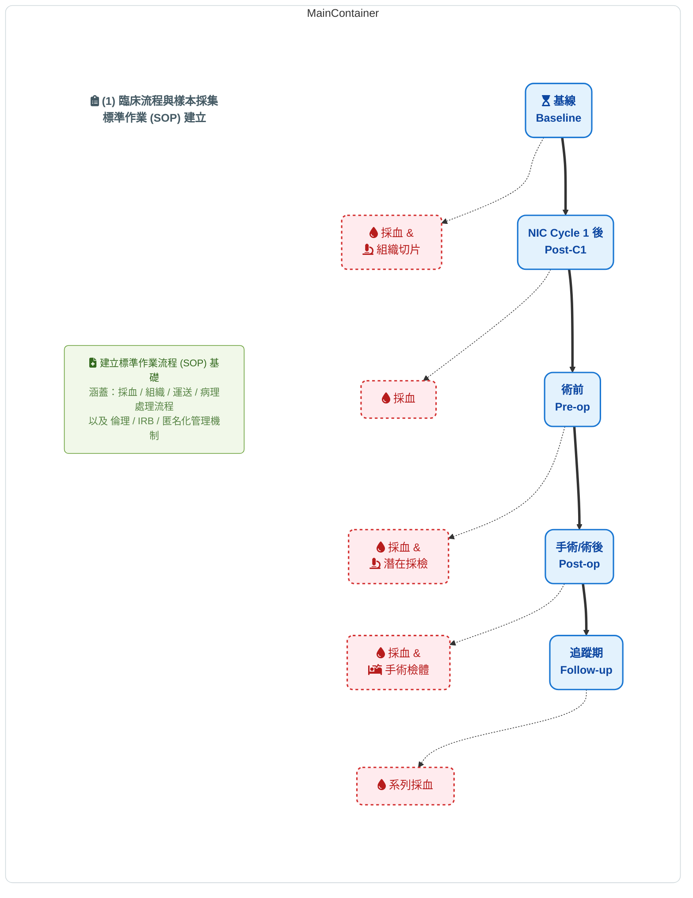

```mermaid
graph LR
    %% =====================================================================================
    %% --- BioRender 風格樣式定義 ---
    %% =====================================================================================
    
    %% timeline: 時間軸節點 - 清透的科學藍，大圓角，粗邊框強調
    classDef timeline fill:#e3f2fd,stroke:#1976d2,stroke-width:2px,color:#0d47a1,font-weight:bold,rx:12,ry:12;
    
    %% sampling: 採樣動作節點 - 代表生物樣本的淡紅/粉色，紅色虛線邊框強調操作性質
    classDef sampling fill:#ffebee,stroke:#d32f2f,stroke-width:2px,stroke-dasharray: 4 4,rx:8,ry:8,color:#b71c1c;
    
    %% sop: 基礎文件節點 - 代表規範與基礎建設的淡綠色
    classDef sop fill:#f1f8e9,stroke:#689f38,stroke-width:1px,rx:6,ry:6,color:#33691e,font-size:14px;
    
    %% container: 最外層容器 - 乾淨的白色背景，細緻的灰色邊框
    classDef container fill:#ffffff,stroke:#cfd8dc,stroke-width:1px,rx:10,ry:10;
    
    %% titleBox: 標題樣式 - 純文字，無邊框背景
    classDef titleBox fill:none,stroke:none,color:#455a64,font-size:16px,font-weight:bold;

    %% =====================================================================================
    %% --- 主圖表內容 ---
    %% =====================================================================================
    subgraph MainContainer
        direction TB
        
        %% --- 1. 總標題 ---
        Title["fa:fa-clipboard-list (1) 臨床流程與樣本採集標準作業 (SOP) 建立"]:::titleBox

        %% --- 2. 核心流程區域 (包含時間軸與採樣) ---
        subgraph ProcessArea [ ]
            direction LR
            
            %% --- 2.1 時間軸層 (水平排列) ---
            subgraph TimelineLayer [ ]
                direction LR
                %% 使用粗箭頭 (==>) 強調主要時間進程
                T1("fa:fa-hourglass-start 基線<br/>Baseline"):::timeline ==> T2("NIC Cycle 1 後<br/>Post-C1"):::timeline ==> T3("術前<br/>Pre-op"):::timeline ==> T4("手術/術後<br/>Post-op"):::timeline ==> T5("追蹤期<br/>Follow-up"):::timeline
            end

            %% --- 2.2 採樣動作層 (水平排列於時間軸下方) ---
            subgraph SamplingLayer [ ]
                direction LR
                %% 加入對應的生醫圖示：血液(tint), 顯微鏡(microscope), 手術(procedures)
                S1["fa:fa-tint 採血 &<br/>fa:fa-microscope 組織切片"]:::sampling
                S2["fa:fa-tint 採血"]:::sampling
                S3["fa:fa-tint 採血 &<br/>fa:fa-microscope 潛在採檢"]:::sampling
                S4["fa:fa-tint 採血 &<br/>fa:fa-procedures 手術檢體"]:::sampling
                S5["fa:fa-tint 系列採血"]:::sampling
                
                %% 使用隱藏連接 (~~~) 確保它們水平排列且間距適當
                S1 ~~~ S2 ~~~ S3 ~~~ S4 ~~~ S5
            end

            %% --- 連接：將時間點與下方的採樣動作關聯 ---
            %% 使用點狀箭頭 (-.->) 表示垂直的關聯性
            T1 -.-> S1
            T2 -.-> S2
            T3 -.-> S3
            T4 -.-> S4
            T5 -.-> S5
        end

        %% --- 3. 底部基礎建設層 (SOP) ---
        subgraph BottomLayer [ ]
            direction LR
             %% 加入文件圖示 (file-medical)
            SOP_Docs["fa:fa-file-medical 建立標準作業流程 (SOP) 基礎<br/><span style='font-size:smaller; opacity:0.8;'>涵蓋：採血 / 組織 / 運送 / 病理處理流程<br/>以及 倫理 / IRB / 匿名化管理機制</span>"]:::sop
        end
        
        %% --- 版面微調 ---
        %% 使用隱藏連接來調整各區塊間的垂直距離
        Title ~~~ ProcessArea
        SamplingLayer ~~~ BottomLayer

    end

    %% =====================================================================================
    %% --- 應用樣式並隱藏內部輔助結構 ---
    %% =====================================================================================
    class MainContainer container
    style ProcessArea fill:none,stroke:none
    style TimelineLayer fill:none,stroke:none
    style SamplingLayer fill:none,stroke:none
    style BottomLayer fill:none,stroke:none
```
