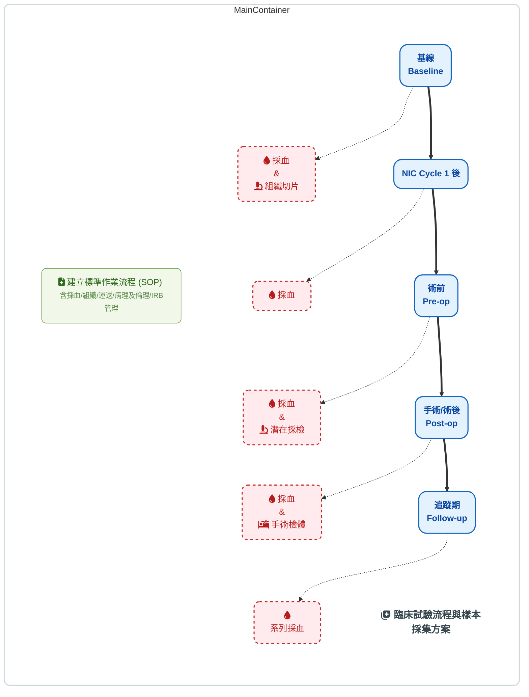

```mermaid
graph LR
    %% --- 定義樣式 ---
    %% timeline: 更清爽的藍色，更大的圓角
    classDef timeline fill:#e3f2fd,stroke:#1565c0,stroke-width:2px,color:#0d47a1,font-weight:bold,rx:15,ry:15;
    %% sampling: 代表生物樣本的淡紅色，紅色虛線邊框
    classDef sampling fill:#ffebee,stroke:#c62828,stroke-width:2px,stroke-dasharray: 5 5,rx:10,ry:10,color:#b71c1c;
    %% sop: 代表基礎建設與文件的淡綠色
    classDef sop fill:#f1f8e9,stroke:#558b2f,stroke-width:1px,rx:8,ry:8,color:#33691e;
    %% container: 乾淨的白色背景，細緻的灰色邊框
    classDef container fill:#ffffff,stroke:#cfd8dc,stroke-width:2px,rx:10,ry:10;
    %% titleBox: 純文字標題樣式
    classDef titleBox fill:none,stroke:none,color:#37474f,font-size:18px,font-weight:bold;

    %% --- 主容器 ---
    subgraph MainContainer
        direction TB
        
        %% 標題 (帶圖標)
        Title["fa:fa-notes-medical 臨床試驗流程與樣本採集方案"]:::titleBox
        
        %% --- 時間軸容器 (水平排列) ---
        subgraph TimelineFlow [ ]
            direction LR
            %% 使用較粗的箭頭 (==>) 強調主要時間進程
            T1("基線<br/>Baseline"):::timeline ==> T2("NIC Cycle 1 後"):::timeline ==> T3("術前<br/>Pre-op"):::timeline ==> T4("手術/術後<br/>Post-op"):::timeline ==> T5("追蹤期<br/>Follow-up"):::timeline
        end

        %% --- 採樣動作容器 (水平排列於下方) ---
        subgraph SamplingActions [ ]
             direction LR
             %% --- 採樣動作 (帶圖標：血液 fa-tint, 顯微鏡 fa-microscope, 手術 fa-procedures) ---
             S1["fa:fa-tint 採血<br/>&<br/>fa:fa-microscope 組織切片"]:::sampling
             S2["fa:fa-tint 採血"]:::sampling
             S3["fa:fa-tint 採血<br/>&<br/>fa:fa-microscope 潛在採檢"]:::sampling
             S4["fa:fa-tint 採血<br/>&<br/>fa:fa-procedures 手術檢體"]:::sampling
             S5["fa:fa-tint<br/>系列採血"]:::sampling
             
             %% 使用隱藏連接 (~~~) 保持它們在水平方向上的相對位置
             S1 ~~~ S2 ~~~ S3 ~~~ S4 ~~~ S5
        end

        %% --- 將時間點與對應的採樣動作連接 ---
        %% 使用點狀箭頭 (-.->) 表示關聯性
        T1 -.-> S1
        T2 -.-> S2
        T3 -.-> S3
        T4 -.-> S4
        T5 -.-> S5

        %% --- SOP 基礎建設 (放置於底部) ---
        subgraph SOP_Section [ ]
            direction TB
            %% --- SOP 文件 (帶圖標：醫療文件 fa-file-medical) ---
            SOP_Docs["fa:fa-file-medical 建立標準作業流程 (SOP) <br/><span style='font-size:smaller; opacity:0.8;'>含採血/組織/運送/病理及倫理/IRB管理</span>"]:::sop
        end
        
        %% 利用隱藏連接調整 SOP 區塊與上方區塊的間距
        SamplingActions ~~~ SOP_Section

    end

    %% 應用樣式
    class MainContainer container
    %% 隱藏內部排版用子圖的邊框與背景
    style TimelineFlow fill:none,stroke:none
    style SamplingActions fill:none,stroke:none
    style SOP_Section fill:none,stroke:none
```
